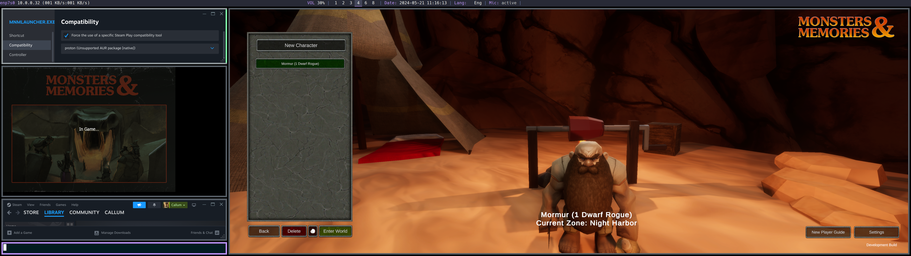

# Monsters & Memories Linux Setup

Native Linux setup and installation instructions for the game Monsters & Memories.

Note that so far we have only tested getting the launcher to run to the point of being able to login and create a characer. Neither of us were around for earlier playtests, so this will likely be updated based on the upcomming June stress/playtests.

# General Requirements

## System Requirements 
- Modern CPU (2017+)
- 16GB of memory DDR4 or higher (2133MT+).
- Any GPU or integrated GPU that supports DirectX 11

## Distribution Requirements
- Kernel 6.1 LTS or Newer
- GUI / Desktop Environment

# Required Packages

To get M&M to run natively on Linux you need a few packages that you may not have installed already if you haven't been playing games on Linux.

## Arch

On Arch, your best bet is to follow the Arch Wiki for installing Steam [here](https://wiki.archlinux.org/title/steam). You'll need to enable multilib packages to install Steam via `pacman`.

After that you want to ensure you have the following:
- [mesa](https://archlinux.org/packages/extra/x86_64/mesa/)
- [32bit OpenGL driver](https://wiki.archlinux.org/title/Xorg#Driver_installation), check the table on this page for the best option for your GPU (for me this was `xf86-video-amdgpu`)
- [Vulkan](https://wiki.archlinux.org/title/Vulkan#Installation), again check the page for which exact package(s) are options for your GPU (I used [vulkan-radeon](https://archlinux.org/packages/?name=vulkan-radeon))
- [proton](https://aur.archlinux.org/packages/proton), you can use the AUR package or alternatively use our setup script to get the latest release from proton's git repo. If you use the AUR pacakge you need to configure the `mnmlauncher.exe` in Steam's compatability settings to use `proton (Unsupported AUR package [native])` (which I have tested, and still works).

# Install script

The install script will prompt you a few times for your distribution info and some other questions, and install some relevant packages + start Steam. Note that currently in the script you need to modify the download link line with your account tag, which you can find by logging into `https://account.monstersandmemories.com`.

# Add the game to Steam + Proton

We have to configure `mnmlauncher.exe` to execute via Proton from steam, to do this:
- within steam `Games` click `Add a Non-Steam Game to My Library` and naviagte to the download location of mnmlauncher.exe
- once added go to the Library tab and right click the game and select properties. 
- next click `Compatibility` and check the "Force the use of a specifoc Steam Play compatibility tools" box
- finally Select the Proton version that starts with `GE`. It should look something like `GE-Proton9-5`
  - if using the AUR package select `proton (Unsupported AUR package [native])`